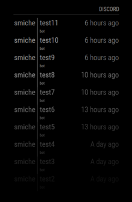
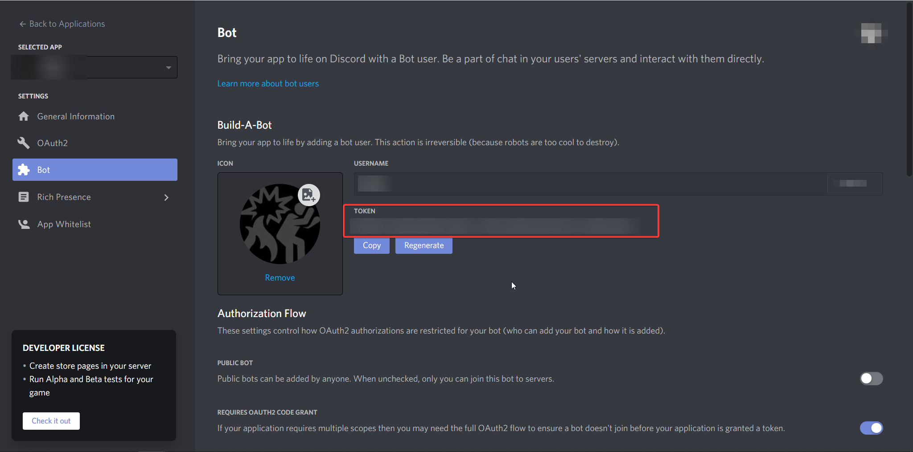
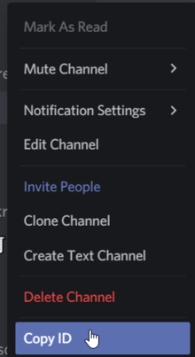

# MMM-DiscordWatch
This is a module for displaying messages from Discord channels on [MagicMirror](https://github.com/MichMich/MagicMirror). 



The module uses discord's bot API and the npm package [discord.js](https://discord.js.org/).

### Installation

1. Go to discord developer and create a new application and a bot. Obtain the bot token and also invite the bot to your server. [(Discord Developer docs)](https://discord.com/developers/docs/intro)

2. Clone the repository in your `modules` folder:
```
git clone https://github.com/Smiche/MMM-DiscordWatch.git
```
3. Go inside the `MMM-DiscordWatch` directory and run:
```
npm install
```
4. Right click on the discord channels you're interest in and copy their ID, then add it to the `subscribedChannels` property:





Example config:


```js
    {
      module: "MMM-DiscordWatch",
      position: "top_right",
      header: "Discord",
      config: {
        discordToken: "<your token here>",
        tableClass: "small",
        maxEntries: 10,
        maxMessageLength: 25,
        maxMessageLines: 1,
        wrapEvents: false, 
        fade: true,
        fadePoint: 0.25,
        showChannel: true,
        subscribedChannels: ["123456891373953034","123456038079119360"], //2 channels to listen to for example
      }
    },
```

### Configuration

| Name           | Description | Default value |
|----------------|---------------------------------|-------------|
| `discordToken` | A discord bot token. | **false** |
| `tableClass`    | Size of the table, only small is tested and verified. `small/medium/large` | **small** |
| `maxEntries`  | Amount of messages to list. | **10**|
| `maxMessageLength` | How many symbols of text can be shown. | **25** |
| `maxAuthorLength` | Maximum length for author nick shown. | **8** |
| `maxMessageLines` | Maximum lines a message can use, if `wrapEvents` is true. | **1** |
| `wrapEvents` | Defines if messages should be wrapped to a new line or not. | **false** |
| `fade` | Used to fade the last messages. | **true** |
| `fadePoint` | Location of the fade. | **0.25** |
| `showChannel` | Whether to show the source channel of the message or not. | **true** |
| `subscribedChannels` | Array of channels that the module will listen to | **[]** |
